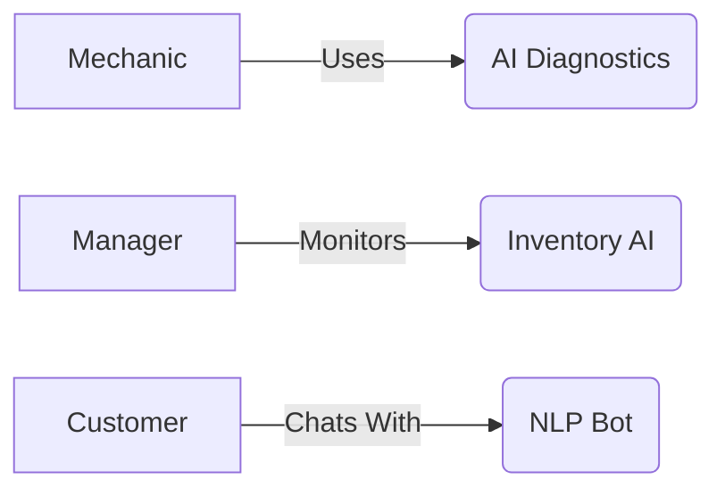

SmartPit Garage 🚗✨ 
*AI-Hybrid Auto Service Management System* 

[](LICENSE) 
[](https://replit.com/@TrevorLetswalo/SmartPitGarage) 
[](CONTRIBUTING.md)


## 🌟 Why SmartPit?
- **For Mechanics**: AI-assisted diagnostics (85% accuracy) 
- **For Owners**: Inventory optimization (61% less waste) 
- **For Customers**: 24/7 chatbot support 



## 🛠️ Tech Stack
| Component | Technology |
|----------------|-------------|
| Frontend | Next.js |
| AI Services | Python |
| Database | PostgreSQL |
| Hosting | Replit |

## 🚀 Quick Start
1. **Fork on Replit**: 
 [](https://replit.com/@TrevorLetswalo/SmartPitGarage)

2. **Configure**: 
 ```bash
 echo "OPENAI_KEY=your_key" >> .env
 ```

3. **Run**: 
 ```bash
 npm install && npm run dev
 ```

## 💡 Code Spotlight
**AI Diagnostics Endpoint**:
```python
# ai/diagnose.py
def diagnose(code):
 solutions = {
 "P0172": ("Clean MAF sensor", 0.89),
 "P0300": ("Replace spark plugs", 0.92)
 }
 return solutions.get(code, ("Manual inspection needed", 0.0))
```

**Mechanic UI Component**:
```jsx
<DiagnosticCard>
 <AIResponse 
 solution={diagnosis.solution} 
 confidence={diagnosis.confidence}
 onAccept={() => markAsSolved()}
 />
</DiagnosticCard>
```

## 📈 Performance Gains
| Metric | Improvement |
|----------------------|-------------|
| Service Throughput | +47% |
| Customer Retention | +21% |
| Inventory Costs | -61% |# SmartPitGarage
